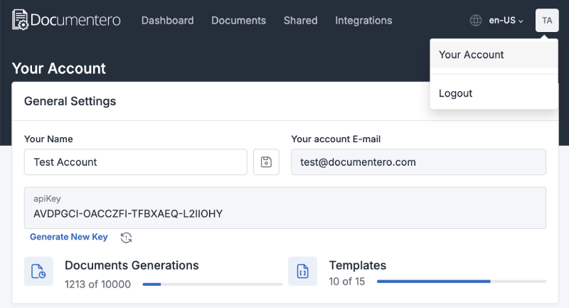
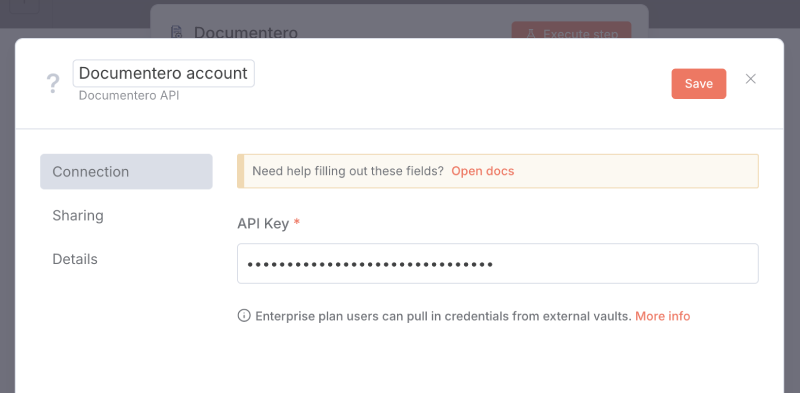
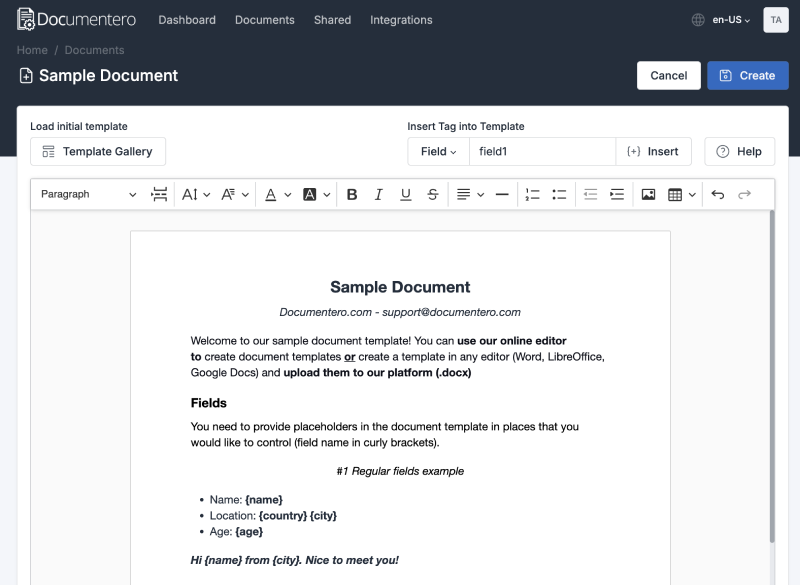
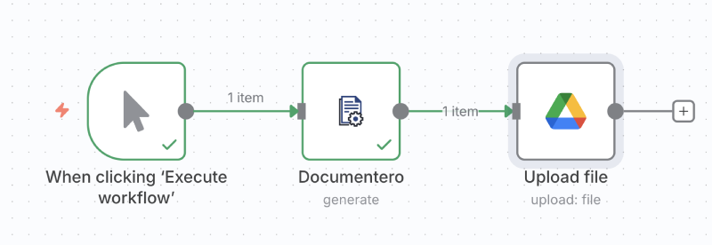
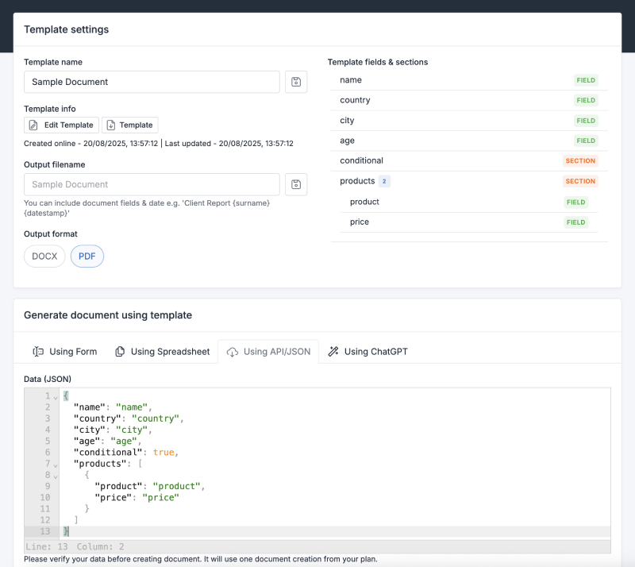
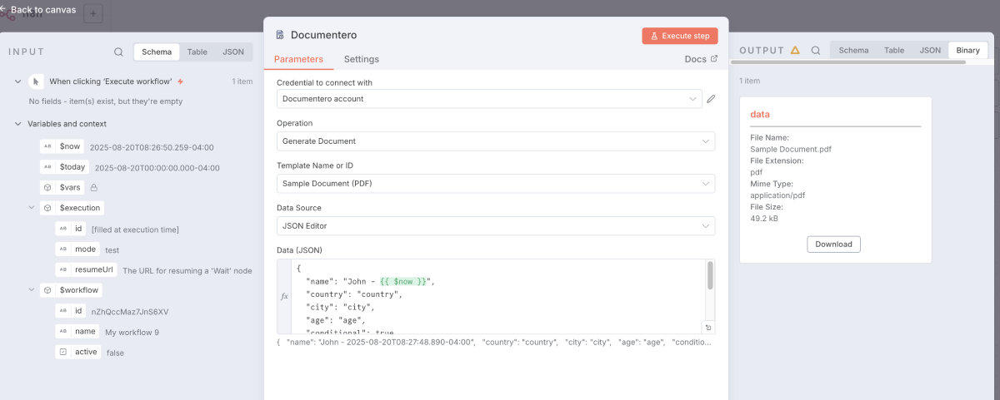

# n8n-nodes-documentero

An n8n community node that integrates the **Documentero API - Document Generation** into your workflows.

[Documentero – Document Generation](https://documentero.com) is a cloud-based document generation service. Generate Word, Excel, and PDF documents from ****.docx/.xlsx templates** via API. Templates support dynamic fields, tables, formulas, conditional sections, images, HTML, Markdown, and QR codes.

[n8n](https://n8n.io/) is a [fair-code licensed](https://docs.n8n.io/reference/license/) workflow automation platform.

## Table of contents

- [Installation](#installation)
- [Operations](#operations)
- [Credentials](#credentials)
- [Usage](#usage)
- [Resources](#resources)
- [License](#license)

## Installation

Follow the [installation guide](https://docs.n8n.io/integrations/community-nodes/installation/) in the n8n community nodes documentation.

## Operations

Supported operations:

- **Generate Document** — Populate a .xlsx or .docx template and generate a document.
- **Generate and Email Document** — Populate a .xlsx or .docx template and send the generated document as an email attachment.

Response fields:

- **data (binary)** — The generated document as a binary file (.docx / .pdf / .xlsx). JSON metadata from the API response is returned alongside the binary; base64 content is removed.

## Credentials

Obtain your API key for Documentero:

1. Log in: https://app.documentero.com/login
2. Open Account Settings: https://app.documentero.com/admin/account
3. Copy the API key assigned to your account.
   
	

4. Use this API key when creating the n8n credentials for the node.
   
	

## Usage

- Create or upload template(s) (.docx/.xlsx) in your Documentero account: https://app.documentero.com
  
	

- Optional: After adding the template, set the output format and default filename on the template overview page in Documentero.
- Add a Documentero node to your workflow.
  
	

- Choose an operation:
	- Generate Document — pass the generated file to downstream nodes (e.g., OneDrive, Google Drive, Outlook).
	- Generate and Email Document — let Documentero email the generated file for you.
- Select the template to use from the “Document Template” dropdown.
- In Documentero (Template Overview → API/JSON), copy the JSON structure and paste it into the node’s Data (JSON) field, then fill in values.
  
	

- Run the workflow.
- The node outputs the generated file under binary > data for further processing (.docx / .pdf / .xlsx).

	

## Resources

* [n8n community nodes documentation](https://docs.n8n.io/integrations/#community-nodes)
* [Documentero Homepage](https://documentero.com)
* [Documentero App](https://app.documentero.com)
* [Documentero Docs](https://docs.documentero.com)

## License

MIT © Documentero